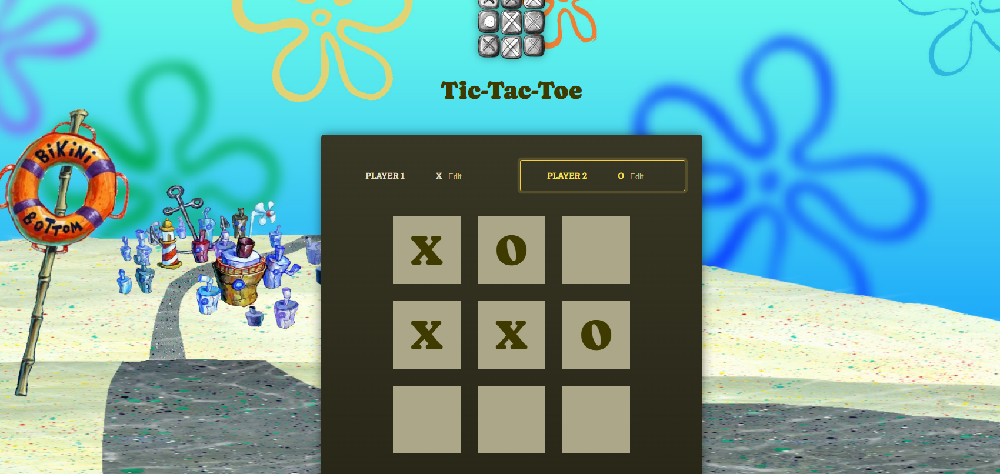

## 🎮 Tic-Tac-Toe – React Game

A simple interactive Tic-Tac-Toe game built with React and Vite.
Players can edit their names, take turns placing their symbols, and the game automatically detects wins or draws.

## ✨ Features

- Dynamic game board

- Player name editing

- Automatic win detection

- Draw detection

- Game restart option

- Turn history log

## 🛠 Built With

- React

- Vite

- JavaScript (ES6)

- CSS

## 🚀 Live Demo

https://tic-tac-toe-eight-gamma-91.vercel.app

## 📸 Screenshot

  

